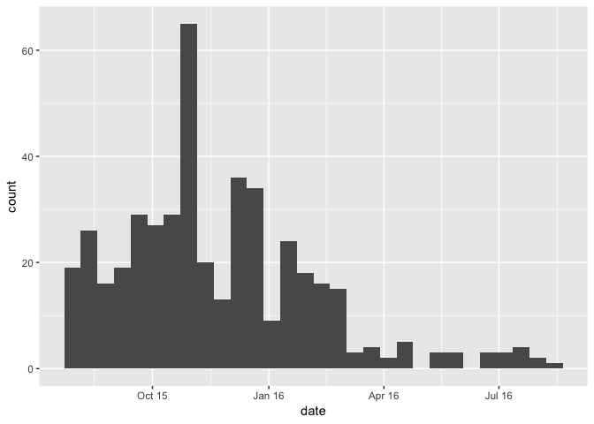
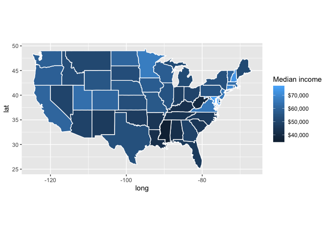
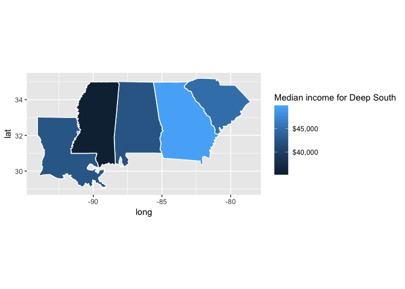

Assignment4
================
Kimberly Louis
10/11/2018

# Trump’s Tweets

Read the below dataset on from
<https://github.com/fivethirtyeight/data/tree/master/trump-twitter>.
Then use the appropriate function from the package `lubridate` to
convert `created_at` into a date.

``` r
library(fivethirtyeight)
library(lubridate)
trump_twitter$created_at<- date(trump_twitter$created_at)
```

Use `geom_histogram` to plot a histogram of tweets count. Change the
x-axis title into ‘date’ and the x-axis labels into a `mon 'yy` format
(e.g., `Dec '15`).

``` r
ggplot(trump_twitter)+
  geom_histogram(aes(x=created_at))+
 scale_x_date(name = "date", date_labels = "%b %y")
```

<!-- -->

Note that there is a difference between time and datetime: If you coerce
`created_at` to a datetime (which keeps information about the time too),
you will need `scale_x_datetime` instead of
`scale_x_date`

``` r
dt <- read_csv('https://raw.githubusercontent.com/fivethirtyeight/data/master/trump-twitter/realDonaldTrump_poll_tweets.csv')
```

# Income map

Use the below dataset to plot a choropleth map of incomes by state. Map
`median_household_income` to the state fill. For a shapefile of the US
states use `map_data("state")`. Adjust the legend setting the title to
“Median income” and formatting the scale as
`$xx,xxx`.

``` r
dt <- read_csv('https://raw.githubusercontent.com/fivethirtyeight/data/master/hate-crimes/hate_crimes.csv')
states <- map_data("state")
dt<- mutate(dt,state = tolower(state))
MHI<- select(dt, state,median_household_income )
states<- right_join(states, MHI, by= c( 'region'='state'))
ggplot(data = states) + 
  geom_polygon(aes(x = long, y = lat, group = group, fill = median_household_income ), color = "white") +
  scale_fill_gradient(labels = scales::dollar_format()) +
  coord_fixed(1.3)+
  labs(fill='Median income')->MHImap
MHImap
```

<!-- -->

Repeat the above for the Deep South only (Louisiana, Alabama,
Mississippi, Georgia, South Carolina). Add a
title.

``` r
dt<- read_csv('https://raw.githubusercontent.com/fivethirtyeight/data/master/hate-crimes/hate_crimes.csv')
dt <- dt %>%
  filter(state == "Louisiana" | state == "Alabama" | state ==  "Mississippi" | state ==  "Georgia"|state== "South Carolina")
states <- map_data("state")
dt <- mutate(dt,state = tolower(state))
MHI<- select(dt, state,median_household_income )
states<- right_join(states, MHI, by= c( 'region'='state'))
ggplot(data = states) +
  geom_polygon(aes(x = long, y = lat, group = group, fill = median_household_income ), color = "white") +   coord_fixed(1.3)+ 
  scale_fill_gradient(labels = scales::dollar_format()) +
  labs(fill = 'Median income for Deep South')->MHImap
MHImap
```

<!-- -->

Use inline code to output the median income (appropriately formatted)
and the Gini-Index for Louisiana.

``` r
LouisiansDATA<- filter(dt, state == "louisiana")
```

The median household income for Louisiana is 42406 and the Gini-Index
for Louisiana is 0.475.
