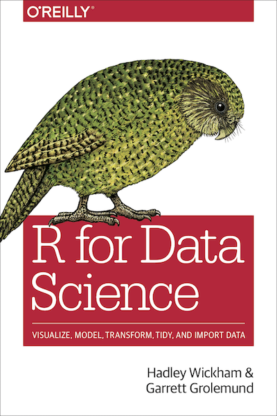

Welcome to ISDS 3105
========================================================
author: 
date: 
autosize: true
css: custom.css

Classes: T-TH 3.00–4.20 PM  
Room: 1835 BEC

Office Hours: T–TH 4.30–5.30 PM   
Room: 2400b BEC  
email: dbonar1@lsu.edu

What you will learn
========================================================

<ol>
  <li>Effective project management using IDE resources (projects) and version control (Git/GitHub)</li>
  <li>Understand the fundamentals of R programming</li>
  <li>Web scraping (using rvest)</li>
  <li>Dataset wrangling and manipulation (using dplyr/tidyr)</li>
  <li>Chart design and creation for data visualization (using ggplot2)</li>
  <li>Efficient and effective results presentation using dynamic and interactive reporting techniques (RMardkown)</li>
  <li>Querying remote relational databases (MySQL) and other source systems (using dplyr)</li>
  <li>T-test and regression (using ggplot2, plotly, infer)</li>
</ol>

Tools we will use
========================================================

Our (free) textbook
========================================================

Wickham, H. and Grolemund, G., 2016. <i>R for data science: import, tidy, transform, visualize, and model data.</i> O'Reilly Media, Inc.

Don't by the paper copy, the latest version is online

Final grade breakdown
======
 
<ul>
<li>Assignments (8) 20%</li>
<li>Mid-term 30%</li>
<li>Group Project 20%</li>
<li>Final Exam 25% </li>
<li>Professionalism 5%</li>
</ul>

 
Where to seek help
======
 
 Textbook: the book has plenty of code and examples that you can look at
 
 Online: post or search prior questions on stackoverflow.com, or google it
 
 Me: come see me during office hours, those are already paid for
 
 Slackgroup: post your question publicly on our course channel
 
Learn how to ask a question on stackoverflow.com before posting
====== 

As your questions using a [reproducible example]() and you may be answered withing seconds!

Answers to questions that do not use a [reproducible example]() sound sometimes rude, but that's just because of the frustration of uncecesfully ask users to use a [reproducible example]().

You'll be surprised by how framing a question as a [reproducible example]() may actually make the solution as self-evident.

Contribute to the quality of the course
====== 

Fell free to open an issue on GitHub for problems with the content (e.g., links not working, bugs)

I'll also be happy to adapt the material based on your feedback so feel free to email or talk to me for critiques 
 
A recipe to succeed in this class
====== 

**Do the ouside class work**. There are not shortcuts: you need to practice (e.g., assignemnt, non-graded exercises), expecially if it is your first coding class. Starting off with the right step is a way easier than catching up later in the semester.

**Be open-minded and patient**. Sometimes there are multiple ways of doing the same thing in R. And there are endless ways of doing things wrong. You may incurr in a few of them before you get something right, so be patient and give yourself enough time before giving up.

**Be collaborative and a team-player**. There is a lot of learning from your classmates mistake, and from collaborative thinking about taclking the same problems. Learning how *not* to do things is learning. And learning different approaches to do the same thing is learning too.

**Be committed since day 1**. The course heavily builds on prior classes. The mid-term exam will ensure you are keeping up with the material.

