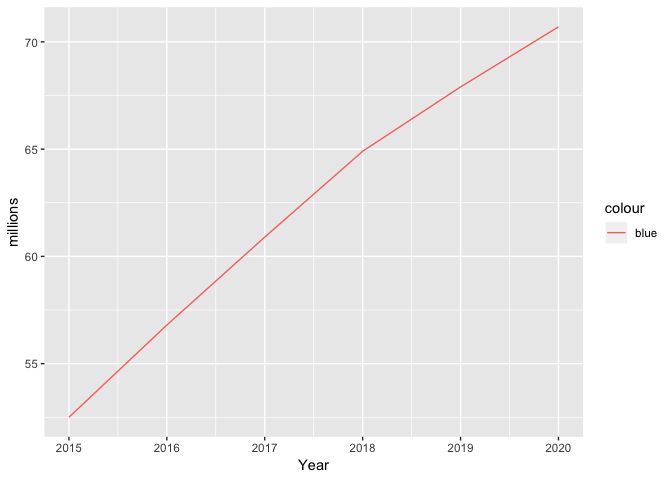

Data visualization
================

# Data Visualization

Base R offers comes with native plotting functions for data
visualization, such as `plot()`, `barplot()`, `pie()`, etc. but we will
not cover them. Instead, we focus on another graphic library called
[ggplot2](http://ggplot2.org/), which is part of the tidyverse package
suite. Despite plotting functions in base R came chronologically before
ggplot2 (and are still widely used), [ggplot2](http://ggplot2.org/)
([cheatsheet](https://www.rstudio.com/wp-content/uploads/2015/03/ggplot2-cheatsheet.pdf))
is probably the most popular package for dataviz. Its rapid success is
due both to the attractive design of its plots and to a more consistent
syntax. Also, there are a number of
[extensions](http://www.ggplot2-exts.org/) developed within the ggplot2
framework that make easier to add themes or create more sophisticated
charts.

\#ggplot2

\#\#References

Check [Chapter 3](http://r4ds.had.co.nz/data-visualisation.html) on
dataviz in ggplot2.

\#\#Installing ggplot2

Because you already installed the tidyverse, calling
`library(tidyverse)` loads `ggplot2` as well. From now on, we will be
using functions that are not part of base R, thus make sure you load
`library(tidyverse)` every time you start a new R session. Also, make
sure you have a `library(tidyverse)` call before you use any ggplot2
function in your RMarkdown (the knitting runs in a new environment). If
you get error messages saying that R `could not find function ...`, you
probably have not loaded the package correctly.

``` r
library(tidyverse)
load(here::here('data', 'dataset.RData'))
```

\#\#Using ggplot2

To be meaningful, each ggplot2 statement requires at least a dataset, a
set of aesthetics that the variables are mapped to, and the geometrical
shape to visualize the aesthetics into.

For instance, to plot a chart of million of twitter users per year:

``` r
ggplot() +
  geom_col(data =  twitter_users, aes(x = Year, y = millions)) +
  ggtitle('A plot of twitter users')
```


ggplot2 builds on an underlying grammar, which entails seven fundamental
elements:

| Element     | Visual attribute                      |
| ----------- | ------------------------------------- |
| data        | dataset with the variables of interst |
| aesthetics  | x-axis, y-axis, color, fill, alpha    |
| geometries  | bars, dots, lines                     |
| facets      | coloumns, rows                        |
| statistics  | bins, smooth, count                   |
| coordinates | polar, cartesian                      |
| themes      | non-data ink                          |

Before you start ‘hacking around’ make sure you understand the [concept
of
*mapping*](http://r4ds.had.co.nz/data-visualisation.html#aesthetic-mappings)
- is fundamental when learning ggplot2\! *To map* means to assign a
variable to an *aesthetic*, namely to a visual property such’ height,
fill color, border color, etc. In the previous example, we mapped only
to x-y coordinates; but read the documnetation of `?geom_col()` to learn
all the *aesthetics* available. For instance, try to map Year to the
fill too:

``` r
ggplot() +
  geom_col(data =  twitter_users, aes(x = Year, y = millions, fill = factor(Year)))
```

Use `freqCasualties` to plot a barchart of the count of casualties by
class and gender (each bar refers to a class)

``` r
#what do we want to map to x and y? how do we map the third variable?
```

Some times, you want to manually **set** a value for a certain
aesthetic, rather than **mapping** a variable to it - in that case the
aesthetic maps to non-data ink element. For instance, note the
difference between the charts below:

``` r
ggplot() +
  geom_line(data =  twitter_users, aes(x = Year, y = millions, color ='blue' )) 
```

<!-- -->

``` r
ggplot() +
geom_line(data =  twitter_users, aes(x = Year, y = millions), color ='blue') 
```

<!-- -->

To change color, you can use either [color
names](http://www.stat.columbia.edu/~tzheng/files/Rcolor.pdf) (e.g.,
‘red’), hex codes (e.g., `#ff0000`) or rgb (e.g. `rgb(255, 0, 0)`).
But why is it not working in the first chart?

So far, we specified aesthetics and datasets inside a specific geom.
However, if we want that multiple `geom_` inherit the same dataset and
aesthetics, you can pass them once within the `ggplot()` statemnt.

``` r
#1. Use the dataset twitter_users
#2. map x = Year and y = millions
#3. pass the aesthetics from 3 to geom_line() and geom_point() 
```

``` r
#use twitter_users to plot a linechart of twitter users over time
#use sn_users to overlay a linechart of FB users over time
```

\#\#\#Exercise:

  - use `beerDt` to create a linechart of beer consumption (in gallons
    of ethanol) in US from 1903.
  - add a layer of points using `geom_point`

Suppose that you now want to flag (e.g., use a different color) the
observation for consumption in your birthyear. We can do it in two
steps:

    1. Create a new variable called 'myBirthYear' that takes value 'My birthyear' for your birth year, and NA for everything else. You could use `ifelse()` or conditional indexing/assignment
    2. Map `myBirthYear` to the fill of `geom_point` to flag your birth year
    3. Use ggtitle to add a title to the chart
