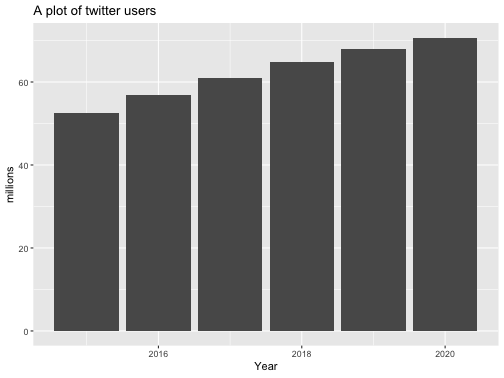
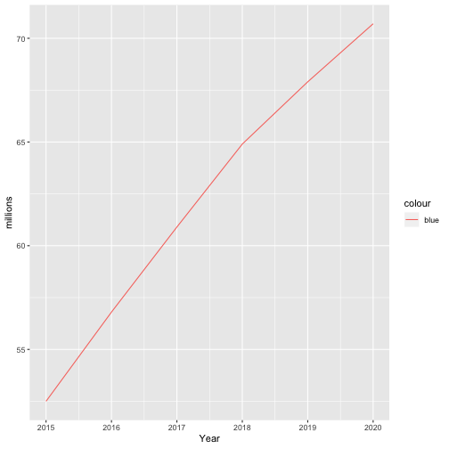
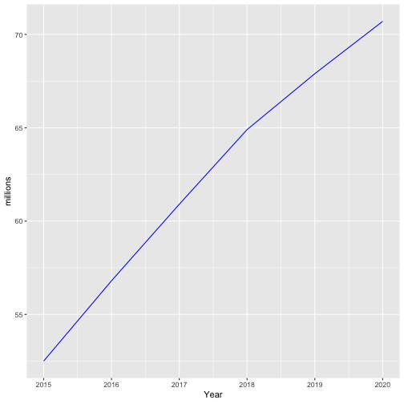
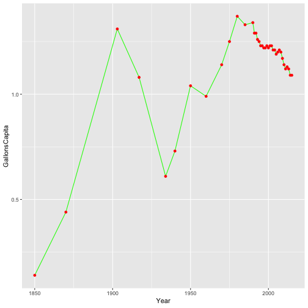

lesson04: Data Visualization in ggplot2
========================================================
author: 
date: 
autosize: true

Data Visualization
===

 - Base R as an built-in visualization library for dataViz. Popular graphic functions in base R are: `plot()`, `barplot()`, `pie()`, etc.
 - We use another library called [ggplot2](http://ggplot2.org/), which is part of the tidyverse package suite. 
 
 
 - [ggplot2](http://ggplot2.org/) ([cheatsheet](https://www.rstudio.com/wp-content/uploads/2015/03/ggplot2-cheatsheet.pdf)) is probably the most popular package for dataviz. Its rapid success is due both to the attractive design of its plots and to a more consistent syntax. Also, there are a number of [extensions](http://www.ggplot2-exts.org/) developed within the ggplot2 framework that make easier to add themes or create more sophisticated charts.

 - Plotting functions in base R came chronologically before ggplot2 (and are still widely used)  

ggplot2
===

**References**: Check [Chapter 3](http://r4ds.had.co.nz/data-visualisation.html) on dataviz in ggplot2.

**Installing ggplot2*

If you have installed `tidyverse`, `library(tidyverse)` loads `ggplot2` as well. 


```r
library(tidyverse)
```

- Make sure you load `library(tidyverse)` every time you start a new R session, otherwise the functions from `ggplot2` won't be available

- Make sure you have a `library(tidyverse)` call before you use any ggplot2 function in your RMarkdown (the knitting runs in a new environment). If you get error messages saying that R `could not find function ...`, you probably have not loaded the package correctly.


```r
load(here::here('data', 'dataset.RData'))
```


Using ggplot2
===

To look meaningful, use ggplot2 with at least a dataset, a set of aesthetics that the variables are mapped to, and the geometrical shape to visualize the aesthetics into. For instance, to plot a chart of millions of twitter users per year:

```r
ggplot() +
  geom_col(data =  twitter_users, aes(x = Year, y = millions)) +
  ggtitle('A plot of twitter users')
```



Cont'd
===
ggplot2 builds on an underlying grammar, which entails seven fundamental elements:

Element | Visual attribute
------------- | -------------
data | dataset with the variables of interst
aesthetics | x-axis, y-axis, color, fill, alpha
geometries | bars, dots, lines
facets | coloumns, rows
statistics | bins, smooth, count
coordinates | polar, cartesian
themes | non-data ink


Cont'd
===

The [concept of _mapping_](http://r4ds.had.co.nz/data-visualisation.html#aesthetic-mappings) is fundamental to learn plotting in ggplot2. **To map** means to assign a variable to an _aesthetic_, namely to a visual property such as height, fill color, border color, etc. 

In the previous example, we mapped only to x-y coordinates. Type `?geom_col()` and scroll down in the help pane to the paragraph _Aesthetics_ for a complete list of the attributes available. For instance, try to map Year to the fill too:


```r
ggplot() +
  geom_col(data =  twitter_users, aes(x = Year, y = millions, fill = factor(Year)))
```

Exercise
===

From `freqCasualties`, plot a barchart of the count of casualties by class and gender (each bar refers to a class)


```r
#what do we want to map to x and y? how do we map the third variable?
```

Mapping values to aesthathics (instead of variables)
===

The examples below show the difference between manually **set** a value for a certain aesthetic, and **mapping** a variable to it. Note the difference between the charts below:


```r
ggplot() +
  geom_line(data =  twitter_users, aes(x = Year, y = millions, color ='blue' )) 
```



```r
ggplot() +
geom_line(data =  twitter_users, aes(x = Year, y = millions), color ='blue') 
```



To change color, you can use either [color names](http://www.stat.columbia.edu/~tzheng/files/Rcolor.pdf) (e.g., 'red'), hex codes (e.g., `#ff0000`) or rgb (e.g. `rgb(255, 0, 0)`).

Mapping values to aesthathics - cont'd
===

So far, we specified aesthetics and datasets inside a specific geom. However, if we want to pass the same dataset and aesthetics to multiple `geom_`, we can pass them once to the `ggplot()` function and let the `geom_` inheriting them from the `ggplot()` statement.


```r
#Use the dataset twitter_users
#Use the set of aesthetics: aes(x = Year, y = millions )
#combine together geom_line() and geom_point() 
```


```r
#use twitter_users to plot a linechart of twitter users over time
#use sn_users to overlay a linechart of FB users over time
```


Exercise: 
===
 - use `beerDt` to plot a linechart of beer consumption (in gallons of ethanol) in US from 1903.
 - add a layer of points using `geom_point`
 
 Suppose that you want to highlight in a different color the observation for the beer consumption consumption in your birthyear. We can do it in two steps:
    
  1. Create a new variable called 'myBirthYear' that takes value 'My birthyear' for your birth year, and NA for everything else. You could use `ifelse()` or conditional indexing/assignment
  2. Map `myBirthYear` to the fill of `geom_point` to flag your birth year
  3. Use ggtitle to add a title to the chart

Exercise
====


```r
ggplot() +  
  geom_line(data =  beerDt, aes(x = Year, y = GallonsCapita), color = 'green' )+
  geom_point(data =  beerDt, aes(x = Year, y = GallonsCapita),  color = 'red')
```




```r
beerDt$birthyear <- beerDt$Year == ...
ggplot(beerDt, aes(x = Year, y = GallonsCapita)) +  
  geom_line()+  
  geom_point(aes(color = ... ))
```


